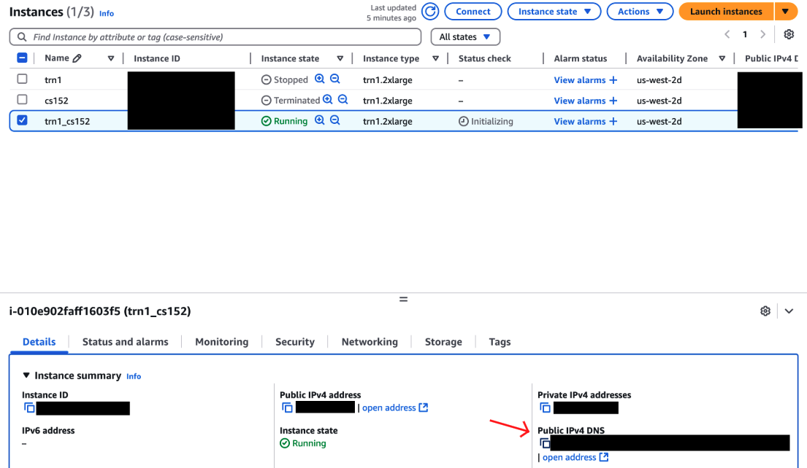

# AWS Setup Instructions
This document will help you launch a Tranium EC2 instance, configure SSH groups to allow you to connect into the instance, and setup auto-shutdown and budget notifications so you don't accidentally burn through your credits. These setup steps may seem tedious, but they will provide you wil valuable experience in setting up cloud computing infrastructure, which you will likely run into in future career and research opportunities.

## Step 1: Launch Instance
The first step is to launch a Tranium EC2 instance.

1. First, log into [AWS Console us-west-2](https://us-west-2.console.aws.amazon.com/ec2/home?region=us-west-2#Home:).
2. Click the orange "Launch Instance" button.
3. Fill in the following information for your instance:
    - Name: trn1_cs152
    - OS Type: Ubuntu
    - AMI: Deep Learning AMI Neuron (Ubuntu 22.04)
    - Instance Type: trn1.2xlarge
<p align="center">
  
</p>

4. Scroll down, and click create new key pair. Select the following for your key pair details:
    - Key pair name: trn1_cs152
    - Key pair type: ED25519
    - Private key file format: .pem
<p align="center">
  
</p>

Click "Create key pair", and the `trn1_cs152.pem` file will be downloaded to your local computer. Once the key is downloaded, move it to your `~/.ssh` directory, and make sure to set the permissions to read only for the owner (400 sets r-- --- --- permissions for the file). 

```bash
mv Downloads/trn1_cs152.pem ~/.ssh
chmod 400 ~/.ssh/trn1_cs152.pem
```

5. Scroll down to the "Network settings" section. Confirm these are the settings (they should be selected by default)
    - Select "Create security group"
    - Select "Allow SSH traffic from" 
    - Select "Anywhere 0.0.0.0/0"

<p align="center">
  
</p>

6. Finally, in the right side of the screen where is says "Summary",
confirm the information is correct, and launch your instance!

<p align="center">
  
</p>


## Step 2: Setup Elastic IPs
This next step is to set up an Elastic IP for your instance. By default, the IPv4 associated with an instance changes each time you launch it. By allocating an Elastic IP and associating it with the instance, we avoid having to change your ssh config each time. 
1. After clicking "Launch Instance" from the previous step, you should have landed back in the EC2 dashboard. Scroll down on the left side of the screen until you get to "Network & Security" settings, and click on Elastic IPs.
2. Click the orange "Allocate Elastic IP address" button in the top-right cornner of the screen
3. Click the orange "Allocate" button. Now, you have an Elastic IP to use.
4. Rename the Elastic IP to trn1_cs152
<p align="center">
  
</p>

5. Make sure the trn1_cs152 Elasic IP is selected (blue checkbox on the left of the name), and click the "Actions" dropdown menu in the top right of the screen.

6. Select "Associate Elastic IP address." Click on the "Instance" selection, and select the trn1_cs152 instance. Click the orange "Associate" button. 
<p align="center">
  
</p>

## Step 3: Setup SSH
This step is to ensure you have SSH access from your local computer to the Trn1 EC2 instance.

1. After clicking "Associate" from the previous step, you should have landed back in the Elastic IP dashboard. Scroll up on the left side of the screen until you get to "Instances" settings, and click on Instances.
2. Click on the checkbox next to your trn1_cs152 instance. Scroll down to the "Details" section and copy the Public IPv4 DNS. It should look like this: ec2-###-###-###-###.us-west-2.compute.amazonaws.com.

<p align="center">
  
</p>


3. Add the following SSH configuration to your local computer `.ssh/config`. Replace the HostName with the DNS you just copied.
```
Host trn1_cs152
    HostName ec2-###-###-###-###.us-west-2.compute.amazonaws.com
    User ubuntu
    IdentityFile ~/.ssh/trn1_cs152.pem
```
4. Now confirm you are able to ssh into the Trn1 instance. From your terminal, run:
```bash
ssh trn1_cs152
```

## Step 4: Setup Auto-Shutdown and Budget
> [!IMPORTANT] 
> 
> This final step is very important! We will set up alarms, auto-shutdown, and budget notifications to make sure you don't brun through your credits accidentally and get your credit card charged.

1. Go back to your instances dashboard on AWS console. Click on the "+" sign next to View Alarms for your trn1_cs152 instance.
2. Configure your alarm as shown in the picture below, and click Create

<p align="center">
  
</p>

3. Search "Budgets" in the top search bar, and in the "Features" section, click on "Budgets". Click on the orange "Create a Budget" button. 
4. Fill in the information to match the picture below, and enter your email for the "Email recipients" section.

<p align="center">
  
</p>

5. Finally, click the orange "Create Budget" button.


## Step 5: Shutdown your instance
Congrats! You have finished the setup steps for launching an AWS Tranium EC2 instance. Go back to your Instances, click on your trn1_cs152 instance, click the "Instance State" dropdown, and click "Stop instance."

> [!IMPORTANT] 
> 
> Everytime you want to connect to your instance, you will need to start the instance, and once you are done working on the instance, you **must shutdown your instance** to prevent extra charges. 


