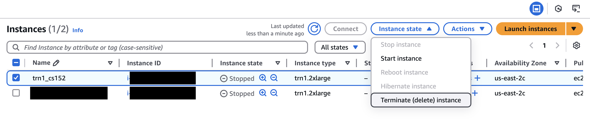
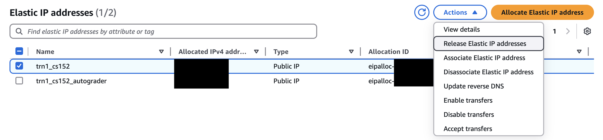
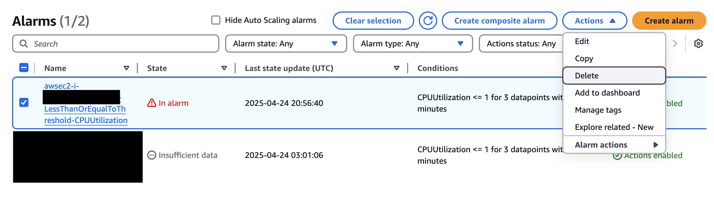
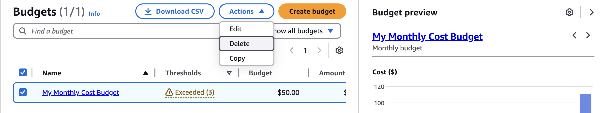

# AWS Setup Instructions
This document will help you free up all of the resources you allocated during the lab. Please follow these directions carefully to prevent extra charges to your account. 

## Terminate your Trn1 Instance
The first step is to terminate your trn1 instance. Go to [Instances](https://us-east-2.console.aws.amazon.com/ec2/home?region=us-east-2#Instances) in your AWS console, select your trn1_cs152 instance, click "Instance state", and click "Terminate (delete) instance."

  

## Release your Elastic IP
Next, you need to free your elastic IP. Go to [Elastic IPs](https://us-east-2.console.aws.amazon.com/ec2/home?region=us-east-2#Addresses:) in your AWS console, select your trn1_cs152 elastic IP, click "Actions", and click "Release Elastic IP addresses."

  

## Delete Cloudwatch Alarm
Then, you need to remove the Cloudwatch alarm you set up for auto-shutdown. Go to [CloudWatch Alarms](https://us-east-2.console.aws.amazon.com/cloudwatch/home?region=us-east-2#alarmsV2), select your alarm, click "Actions", and click "Delete."

  

## Delete your Cost Budget
Finally, delete your Monthly Cost Budget. Go to [Budgets](https://us-east-1.console.aws.amazon.com/costmanagement/home?region=us-east-2#/budgets/overview), select your Monthly Cost Budget, click "Actions", and click "Delete."

  

