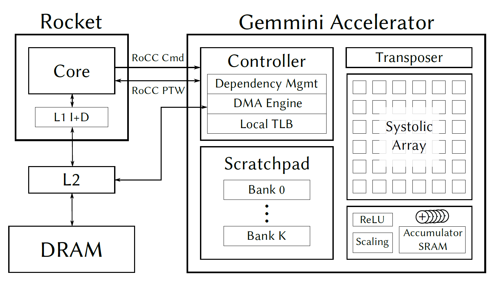
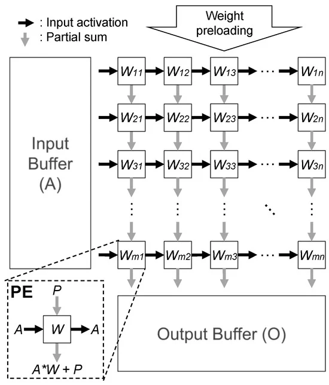

# CS152 Laboratory Exercise 6

## Introduction:
The goal of this laboratory assignment is to give you an opportunity to program hardware accelerators. As the computational demands of AI and ML applications continue to increase, industry and research efforts have been attempting to meet these demands with Domain Specific Acceleration and custom accelerator hardware. As a result, an increasingly important skill is the ability to map software applications and kernels onto new architectures. 

It is important to learn how to optimize programs to take full advantage of the memory and compute engines available on the target hardware. There are many factors to consider when designing a kernel, such as the communication between compute engines and memory, the amount of data a compute engine can do work on at a given time, the dependencies between different computations in your kernel, and more. By the end of this lab, you should be able to program basic kernels on two targets: [Gemmini](https://github.com/ucb-bar/gemmini/tree/master) and [NeuronCore](https://awsdocs-neuron.readthedocs-hosted.com/en/latest/general/arch/neuron-hardware/neuron-core-v2.html#neuroncores-v2-arch) (the main accelerator device in [AWS Tranium](https://aws.amazon.com/ai/machine-learning/trainium/) machines).

### Graded Items:
All reports are to be submitted through [Gradescope](https://www.gradescope.com/courses/959486)

> [!IMPORTANT] 
> 
> TODO: Add details on assignment here:
> - Link to Gradescope Assignment
> - Directed vs Open-Ended split?
> - Submission details for each question
> - Page limits


## Directed Portion

### Step 1: Gemmini Overview

Gemmini is a hardware accelerator that is part of the Chipyard ecosystem that we have been using throughout the previous labs of this course. You have previously seen Rocket Core (Berkeley's single-issue, in-order RISC-V processor) and BOOM (Berkeley's Out of Order RISC-V Core), both of which are RISC-V CPU architectures. By contrast, Gemmini is based around a systolic array architecture, and acts as a hardware accelerator attached to a Rocket Core.

<p align="center">
  
</p>

Customization is a major focus of Chipyard, and you can learn more about the various ways Chipyard enables customization in [Chapter 6 of the Chipyard Docs: Customization](https://chipyard.readthedocs.io/en/latest/Customization/index.html). Gemmini integrates with a Rocket Core through the RoCC(Rocket Custom Coprocessor) Interface. The RoCC interface allows the accelerator to communicate with the Rocket Core and the L1 Cache. The Rocket Core recieves instructions, and when it decodes a custom instruction (opcode custom[0-3]), it sends them to the accelerator. You can read about the custom instructions Gemmini uses here: [Gemmini ISA overview](https://github.com/ucb-bar/gemmini/tree/master?tab=readme-ov-file#isa).

The Gemmini accelerator is based around a systolic array architecture as mentioned earlier. Systolic array architectures are often used in ML and AI applications because they are suited for computing operations on matrices, which are often used in applications like Neural Networks and Large Language Models. A systolic array is a type of spatial array, which describes a family of architectures that use arrays of compute cells called PEs (Processing Elements), which typically do MAC (Multiply and Accumulate) operations.

<p align="center">
  
  <br>
  <a href="https://www.mdpi.com/2079-9292/13/8/1500">Source</a>
</p>

Systolic arrays are good for kernels like matrix multiplication, as they have high data reuse. From the animation below, you can see that one 3 by 3 matrix is loaded into the PE array, while the other 3 by 9 matrix streams into the PEs. The output 3 by 9 matrix is streamed out of the systolic array after 3 MAC operations (since for a 3x3 by 3x9 matrix multiplication, each row by column inner product is 3 multiply and add operations).

<p align="center">
  
  <br>
  <a href="https://medium.com/lightmatter/matrix-processing-with-nanophotonics-998e294dabc1">Source</a>
</p>

### Part 2: Setting up Chipyard
To get started, clone the lab chipyard repo:
```bash
cd /scratch/${USER} 
source conda/etc/profile.d/conda.sh
git clone https://github.com/ucb-bar/chipyard-cs152-sp24.git cs152-lab6-sp25
cd cs152-lab6-sp25
git checkout cs152-lab6-sp25
./build-setup.sh riscv-tools --skip-toolchain --skip-firesim --skip-marshal --skip-circt
```

Run these commands everytime you want to start a new terminal
```bash
cd /scratch/${USER} 
source conda/etc/profile.d/conda.sh 
cd cs152-lab6-sp25
source env.sh 
LAB6ROOT=$PWD 
SIMDIR=${LAB6ROOT}/sims/verilator
GEMDIR=${LAB6ROOT}/generators/gemmini
TESTDIR=${GEMDIR}/software/gemmini-rocc-tests/bareMetalC/
BINDIR=${GEMDIR}/software/gemmini-rocc-tests/build/bareMetalC/
```

### Part 3: Basic Tests on Gemmini
To start developing and running simulations on Gemmini, first build the Gemmini software tests.

```bash
cd ${GEMDIR}/software/gemmini-rocc-tests
./build.sh
```

Now, build the Gemmini simulator using verilator. 
```bash
cd ${SIMDIR}
make -j4 CONFIG=GemminiRocketConfig
```

Finally, try running the template test
```bash
cd ${SIMDIR}
make CONFIG=GemminiRocketConfig run-binary BINARY=${BINDIR}/template-baremetal
```

After sometime, you should see print statements with the actions the program is taking to move data and do computations using the Gemmini Accelerator. Take a look at `gemmini-rocc-tests/bareMetalC/template.c` to get an idea of how the C file of the binary we ran is going through the following steps:
1. Initializing Gemmini's TLB
2. Allocating the memory for the input and output matrices
3. Configuring and loading the identity matrix
4. Multiplying by the input matrix
5. Moving the Output matrix into main memory
6. Checking that the input = output

As you can tell, programming the accelerator requires not only knowledge of the programming language (in this case C), but also the special ways and instructions we must use to interact with the hardware accelerator, which we can consider as a "accelerator API". 

A large portion of ongoing development in research and industry is making the programming interface for accelerators easier, and some companies even develop plugins for their accelerator API in packages like PyTorch to allow developers to program directly in Python. However, lowering these high-level abstractions into the hardware API is still a work in progress, and getting the best performance will still involve direct programming in the hardware API while incorporating knowledge of the accelerator's architecture, features, and limitations.

> [!NOTE]
>
> Before proceeding, make sure to read the [Gemmini ISA overview](https://github.com/ucb-bar/gemmini/tree/master?tab=readme-ov-file#isa) if you have not done so already. 

Now, answer these questions in your lab report. You may want to look at the C header files like `gemmini-rocc-tests/include/gemmini_params.h` and `gemmini-rocc-tests/include/gemmini.h`.
> [!IMPORTANT]
>
> **Question 1.** Take a look at the `gemmini_flush` function. What type of ROCC instruction does it call? What are the values for the fields that make up the ROCC instruction?
> 
> 
> **Question 2.** Notice that the `gemmini_config_ld` and `gemmini_config_st` functions only pass the size of the matrix along the row dimension. Why do you think this is?
>
>
> **Question 3.** What is the data type of the input and output matrices? What are the dimensions and total size (in bytes) of each matrix? (*Hint: look at `gemmini_params.h`*)
>
>
> **Question 4** What function could we use to preload the array with a value (e.g. load the array with 15)?


### Part 4: Building a Feedforward Neural Network on Gemmini

Now that you have a basic understanding for the Gemmini accelerator and instruction set, we will build a basic feedforward neural network. We will quickly overview how a feedforward neural network functions, but for the sake of this exercise, all you need to understand is that the calculations for the network can be translated into matrix multiplications, which is a great way for us to use the Gemmini accelerator.

#### Quick Overview of Feedforward Neural Networks

<p align="center">
  
  <br>
  <a href="https://www.geeksforgeeks.org/feedforward-neural-network/">Source</a>
</p>

A feedforward neural network is a type of neural network where the information flows through the layers in one direction. We start with the input layer, which recieves the initial data, with each neuron acting as a feature of the input data. 

Then, we pass through multiple hidden layers, and each neuron applies a weighted sum of its inputs, often with an added bias, followed by an activation function. This is calculation is often expressed as a matrix multiplication. The input matrix `X` has dimensions `(N, d)`, where `N` is the number of samples, and `d` is the number of input features. Each of the hidden layers weight matrix `W` and a bias vector `b`. The `W` matrix has dimensions `(d, h)`, where `h` is the number of neurons in the hidden layer. You can calculate the hidden layer neurons with the equation `H = ACT(XW+b)`, where `ACT` is some activation function like [ReLu](https://www.geeksforgeeks.org/relu-activation-function-in-deep-learning/).  

Finally, we end with the output layer, which contains neurons that correspond to the intended output of the neural network. For example, in a classification problem, the each neuron would correspond to a class, and the neuron with the highest activation would be the class the neurla network is assigning to the input.

If you would like to learn more on feedforward neural networks, check out [this article](https://www.geeksforgeeks.org/feedforward-neural-network/). 

#### Designing a Neural Network Kernel using Gemmini

Now we will use the Gemmini accelerator to perform the calculations needed for a feedforward neural network. We have provided a template to get started with in `${LAB6ROOT}/lab/ffnn.c`.

1. Generate the weights and copy over the template code.
```bash
cd ${LAB6ROOT}/lab/
GEMDIR=$GEMDIR ./generate.sh
```

2. Add `ffnn` to the list of tests in `${TESTDIR}/Makefile`

3. Modify `ffnn.c` to perform the calculations of a feedforward neural network. Follow the comments, and use the functions in `gemmini.h` as well as the descriptions in [Gemmini ISA overview](https://github.com/ucb-bar/gemmini/tree/master?tab=readme-ov-file#isa) to complete the code.

4. Rebuild the tests with your modifications. The binary for ffnn.c will now be in `${BINDIR}/ffnn-baremetal`
```bash
cd ${GEMDIR}/software/gemmini-rocc-tests/
./build.sh
```

5. Run the `ffnn-baremetal` binary on the Gemmini simulator and ensure that your test passes.
```bash
cd ${SIMDIR}
make CONFIG=GemminiRocketConfig run-binary BINARY=${BINDIR}/ffnn-baremetal
```

Once your test passes, answer the following questions in your lab report.
> [!IMPORTANT]
>
> **Question 5.** TODO


### Part 5: Tranium Overview
Now, we will switch to work on AWS Tranium. While the architectures are similar (both have a systolic array as the main compute engine), Tranium is magnitudes more powerful than what Gemmini is capable of doing, as it is a datacenter-scale chip and not just for research purposes. 

The `Trn1.2xlarge` instance you will setup in Part 6 will be the target hardware from your programs for the rest of this lab. This instance contains a single Tranium Device, which has 2 NeuronCores. Each core has a HBM (High-bandwidth memory) unit and on-chip storage units that the compute units interface with. Each core has various compute units optimized for different functions:
- Tensor Engine: 128 x 128 systolic array for matrix operations
- Vector Engine: 128-wide vector unit, reductions, dependent calculations
- Scalar Engine: 128-wide scalar unit, for activation functions, independent calculations
- GpSimd Engine: general-purpose engine for operations not suited for the other engines

<p align="center">
  
  <br>
  <a href="https://awsdocs-neuron.readthedocs-hosted.com/en/latest/general/nki/arch/trainium_inferentia2_arch.html#trainium-inferentia2-arch">Source</a>
</p>

As mentioned before, there are various levels of memory at play in the Tranium Instance. There is the host memory that is external to the Neuron Cores. Then, there is the HBM, which is the main on-device memory. Finally there is the on-chip memory, consisting of the SBUF (State Buffer) and the PSUM (Partial Sum Buffer). The levels, sizes, and bandwidths of these memories are shown below.

<p align="center">
  
  <br>
  <a href="https://github.com/stanford-cs149/asst4-trainium/tree/main">Source</a>
</p>

All computations require laoding data from the HBM into the SBUF, which is connected as an input to all of the engines. The output of the Tensor Engine is stored in the PSUM, which can be an input to the Vector and Scalar Engines. The Vector, Scalar, and GpSimd engine can write back to the SBUF. 

<p align="center">
  
  <br>
  <a href="https://awsdocs-neuron.readthedocs-hosted.com/en/latest/general/nki/arch/trainium_inferentia2_arch.html#trainium-inferentia2-arch">Source</a>
</p>

There are a lot of factors at play when writing kernels on Tranium devices, and good kernels will take advantage of the compute engines and memory heirarchy to reduce bottlenecks and extract the most performance. For more details on Tranium architecture, look at the [Tranium Architecture Guide](https://awsdocs-neuron.readthedocs-hosted.com/en/latest/general/nki/arch/trainium_inferentia2_arch.html#trainium-inferentia2-arch).


### Part 6: Tranium Setup
To begin working on Tranium, follow the instructions in [AWS_SETUP.md](/AWS_SETUP.md)

### Part 7: Basic Tests on Tranium


## Open-Ended Portion
TODO


## Acknowledgements
The original material for this lab was designed by Ronit Nagarapu in Spring 2025. The Gemmini portion of the lab was made possible by the contributions of the Gemmini team at UC Berkeley. The Tranium portion of the lab was developed with the assistance of AWS and inspired by the Stanford CS149 Tranium assignments.