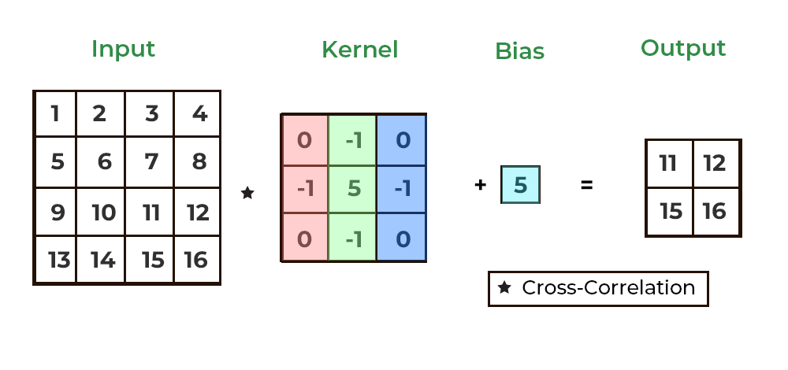

# CS152 Laboratory Exercise 6

## Introduction and Goals:
The goal of this laboratory assignment is to give you an opportunity to program hardware accelerators. As the computational demands of AI and ML applications continue to increase, industry and research efforts have been attempting to meet these demands with Domain Specific Acceleration and custom accelerator hardware. As a result, an increasingly important skill is the ability to map software applications and kernels onto new architectures. 

It is important to learn how to optimize programs to take full advantage of the memory and compute engines available on the target hardware. There are many factors to consider when designing a kernel, such as the communication between compute engines and memory, the amount of data a compute engine can work on at a given time, the dependencies between different computations in your kernel, and more. By the end of this lab, you should be able to program basic kernels on [NeuronCore](https://awsdocs-neuron.readthedocs-hosted.com/en/latest/general/arch/neuron-hardware/neuron-core-v2.html#neuroncores-v2-arch), the main accelerator device in [AWS Tranium](https://aws.amazon.com/ai/machine-learning/trainium/) machines.

There are two sections of the lab, the Directed and Open-Ended Portions. The Directed Portion is intended to familiarize you with programming for the Tranium accelerator, while the Open-Ended portion will allow you to explore optimizing your programs to get maximal performance out of the hardware. There will be many links to documentation during the lab, and we **highly** recommend you do your best to read them thoroughly. It will be difficult to program the accelerator, and more importantly, it will be tough to optimize your programs without background context.

> [!NOTE]
>
> This lab was made possible with the support of AWS, and they will be awarding prizes to the students with the most optimal programs! See the [Open-Ended Prizes](#prizes) section for more details.


### Graded Items:
All graded items are to be submitted through [Gradescope](https://www.gradescope.com/courses/959486). The Directed and Open-Ended portions of the lab must both be completed individually, unless otherwise approved by course staff. The Directed portion is worth 30% of your lab grade, and the Open-Ended portion is worth 70% of your lab grade. 

The Directed and Open-Ended portion are both due **Friday, May 2 at 11:59PM**. You may continue to optimize your Open-Ended kernels for the competition until **Friday, May 9 at 11:59PM**, after which the competition will be closed and the prizes awarded. 

Finally, after completing the lab, you will need to fill out a feedback form. Failure to fill out the form will result in a penalty to your lab grade. The form helps us improve this lab for future versions of the course, so any feedback, positive or negative, is greatly appreciated!

Graded Items:
- Code for Directed Portion: `nki_ffnn/kernels.py`
- Code for Open-Ended Portion: `nki_conv2d/conv2d.py`
- Submission to the feedback form

## Background:
### ML Accelerator Hardware
In previous labs and lectures, you have learned about various architectures like CPUs (scalar, superscalar, out-of-order, VLIW, etc.), Vector Engines, GPUs, etc. One type of architecture that is common in ML accelerator chips is the **systolic array**. Systolic array architectures are often used in ML and AI applications because they are suited for computing operations on matrices, which are often used in applications like Neural Networks and Large Language Models. A systolic array is a type of spatial array, a family of architectures that use arrays of compute cells called PEs (Processing Elements), which typically do MAC (Multiply and Accumulate) operations. 

<p align="center">
  
  <br>
  <a href="https://www.mdpi.com/2079-9292/13/8/1500">Source</a>
</p>

Systolic arrays are good for kernels like matrix multiplication. From the animation below, you can see that one 3 by 3 matrix is loaded into the PE array, while the other 3 by 9 matrix streams into the PEs. The output 3 by 9 matrix is streamed out of the systolic array after 3 MAC operations (since for a 3x3 by 3x9 matrix multiplication, each row by column inner product is 3 multiply and add operations).

<p align="center">
  
  <br>
  <a href="https://medium.com/lightmatter/matrix-processing-with-nanophotonics-998e294dabc1">Source</a>
</p>


### Tranium Overview
In this lab, we will work on AWS Tranium. You can find the full architecture guide here: [Trainium Architecture Guide for NKI](https://awsdocs-neuron.readthedocs-hosted.com/en/latest/general/nki/arch/trainium_inferentia2_arch.html), but here is a brief overview: 


Tranium instances contain a single Tranium Device, which has 2 NeuronCores. Each NeuronCore has an HBM (High-bandwidth memory) unit and on-chip storage units that the compute units interface with. Each core has various compute units optimized for different functions:
- Tensor Engine: 128 x 128 systolic array for matrix operations
- Vector Engine: 128-wide vector unit, reductions, dependent calculations (each output element may depend on multiple input elements)
- Scalar Engine: 128-wide scalar unit, for activation functions, independent calculations (each output element may depend on a single input element)
- GpSimd Engine: general-purpose engine for operations not suited for the other engines

Read the [NeuronCore Compute Engines](https://awsdocs-neuron.readthedocs-hosted.com/en/latest/general/nki/arch/trainium_inferentia2_arch.html#neuroncore-v2-compute-engines) section of the architecture guide for more details on each engine.

The NeuronCores are highly optimized and designed for ML workloads, and thus, each engine has its own unique purpose in common ML algorithms. We can get maximal performance out of the chip if we carefully integrate the engines together. We must make sure that our algorithm is designed such that computations are mapped to the appropriate and most powerful engines while accounting for bandwidth and throughput constraints. We must also plan for communications between engines based on their internal connections and the on-chip memory system.

<p align="center">
  
  <br>
  <a href="https://awsdocs-neuron.readthedocs-hosted.com/en/latest/general/nki/arch/trainium_inferentia2_arch.html#trainium-inferentia2-arch">Source</a>
</p>

There are various levels of memory at play in the Tranium Instance. There is the host memory that is external to the Neuron Cores. Then, there is the HBM, which is the main on-device memory. Finally, there is the on-chip memory, consisting of the SBUF (State Buffer) and the PSUM (Partial Sum Buffer). The levels, sizes, and bandwidths of these memories are shown below. When developing kernels, we can also optimize performance by planning our loads and stores based on these architectural parameters and the use of the data in the kernel (i.e. tiling, maximal data reuse, etc).

<p align="center">
  
  <br>
  <a href="https://github.com/stanford-cs149/asst4-trainium/tree/main">Source</a>
</p>

All computations require loading data from the HBM into the SBUF, which is connected as an input to all of the engines. The output of the Tensor Engine is stored in the PSUM, which can be an input to the Vector and Scalar Engines. The Vector, Scalar, and GpSimd engines can write back to the SBUF. Note that the SBUF and PSUM contain 128 partitions each, which are similar to banks of memory. These have connections to the 128 lanes in the Tensor, Scalar, and Vector engines. Thus, optimizing kernels will require tiling memory and compute instructions over the 128 lanes and partitions. Read the [Data Movement](https://awsdocs-neuron.readthedocs-hosted.com/en/latest/general/nki/arch/trainium_inferentia2_arch.html#data-movement) section of the architecture guide for more information.

<p align="center">
  
  <br>
  <a href="https://awsdocs-neuron.readthedocs-hosted.com/en/latest/general/nki/arch/trainium_inferentia2_arch.html#trainium-inferentia2-arch">Source</a>
</p>

There are a lot of factors at play when writing kernels on Tranium devices, and good kernels will take advantage of all of the compute engines and full memory hierarchy to reduce bottlenecks and extract the most performance. For more details on Tranium architecture, look at the [Tranium Architecture Guide for NKI](https://awsdocs-neuron.readthedocs-hosted.com/en/latest/general/nki/arch/trainium_inferentia2_arch.html#trainium-inferentia2-arch).


## Setup
Follow the steps below to set up the Tranium instance you will be using for the lab.

### Launch and Configure Tranium Instance
To begin working on Tranium, follow the instructions in [AWS_SETUP.md](/AWS_SETUP.md)

> [!IMPORTANT] 
> 
> Do not proceed with the rest of the lab without completing this step.

### Setup Repository and Environment

#### Setup GitHub Classroom Repository
To begin, accept the GitHub Classroom invite sent to your @berkeley.edu email. This will create a personal repo for you to push your code and track your work. After you have created your project repo with GitHub Classroom, launch your Tranium instance and connect to it via SSH, a remote session using VSCode, or another application. 

Once you have logged into the instance, make sure you have GitHub configured.

- [Configure your name in git](https://docs.github.com/en/get-started/getting-started-with-git/setting-your-username-in-git)
- [Configure your email address in git](https://docs.github.com/en/account-and-profile/setting-up-and-managing-your-personal-account-on-github/managing-email-preferences/setting-your-commit-email-address#setting-your-commit-email-address-in-git).
  Use your Berkeley email address.
- [Create an SSH key](https://docs.github.com/en/authentication/connecting-to-github-with-ssh/generating-a-new-ssh-key-and-adding-it-to-the-ssh-agent?platform=linux#generating-a-new-ssh-key).
  If you create your SSH key with a password, you'll need to type your password every time you push/pull. We recommend leaving the password blank, but it's your choice.
- [Add the SSH key to your GitHub account](https://docs.github.com/en/authentication/connecting-to-github-with-ssh/adding-a-new-ssh-key-to-your-github-account#adding-a-new-ssh-key-to-your-account).

Once you are done, be sure that you can authenticate to GitHub via SSH by running:

```bash
ssh -T git@github.com
```

If you have configured things correctly, you should see something like this:
```bash
Hi <YOUR GITHUB USERNAME>! You've successfully authenticated, but GitHub does not provide shell access.
```

Finally, clone the repository you created earlier on GitHub Classroom and add this repo as a skeleton remote so you can get the template code (replace <USERNAME> with your GitHub username that created the classroom repository).
```bash
git clone git@github.com:ucb-152/lab6-<USERNAME>.git
cd lab6-<USERNAME>
git remote add skeleton https://github.com/ucb-152/lab6
git pull skeleton main
```

#### Run Setup Scripts
Now, run the `install.sh` script.
```bash
source install.sh
```
The install script will activate the Python virtual environment prebuilt on the AWS instances with the Deep Learning AMI (`source /opt/aws_neuronx_venv_pytorch_2_5/bin/activate`), which contains all the dependencies needed for the assignment. It will also modify your `~/.bashrc` file so that the virtual environment is activated automatically upon future logins to your machine. Finally, the script sets up your InfluxDB credentials so that you may use neuron-profile, which will be useful for future sections.

> [!IMPORTANT]
> 
> Now, shut down your instance before proceeding

#### Local Setup
We will also set up the repo on your local computer. If you have not already used GitHub on your local computer before, make sure to follow the same steps from above to configure your git name, email, and SSH access.

Clone the GitHub repo to your local machine 
```bash
git clone git@github.com:ucb-152/lab6-<USERNAME>.git
cd lab6-<USERNAME>
git remote add skeleton https://github.com/ucb-152/lab6
git pull skeleton main
```

This will allow you to program and develop your kernels locally. Once you are ready to test them, you can push your changes to GitHub and pull them on the Tranium instance to simulate or benchmark them. While you are allowed to develop your kernels directly while connected to the Tranium instance, keep an eye on how long you are taking and make sure you are not burning through your credits. You have enough credits for roughly 40-50 hours of Tranium time. We recommend you do your initial development locally, then migrate to Tranium to simulate and benchmark the kernels. 

> [!WARNING]
>
> Make sure to only make changes on your local or Tranium repository at a single time, otherwise you may run into merge conflicts.


## Directed Portion (30%)
For the Directed portion, you are tasked with developing an `ffnn` (Feedforward Neural Network) kernel on Tranium. The goal of this task is to familiarize yourself with the Tranium and NeuronCore architecture and learn how to program them using AWS's Neuron Kernel Interface or NKI, which you will learn more about soon.

### Overview of Feedforward Neural Networks

<p align="center">
  
  <br>
  <a href="https://www.geeksforgeeks.org/feedforward-neural-network/">Source</a>
</p>

A feedforward neural network is a type of neural network where the information flows through the layers in one direction. We start with the input layer, which receives the initial data, with each neuron acting as a feature of the input data. 

Then, we pass through multiple hidden layers, and each neuron applies a weighted sum of its inputs, often with an added bias, followed by an activation function. This calculation is often expressed as a matrix multiplication. The input matrix `X` has dimensions `(N, d)`, where `N` is the number of samples (often referred to as the batch size), and `d` is the number of input features. Each connection between layers can be represented by a weight matrix `W` and a bias vector `b`. The `W` matrix has dimensions `(d, h)`, where `h` is the number of neurons in the hidden layer. The bias vector `b` has a length of `h`. 

You can calculate the activations of the next layer of neurons with the equation `H = ACT(XW+b)`, where `ACT` is some activation function like [ReLu](https://www.geeksforgeeks.org/relu-activation-function-in-deep-learning/) (typically used on the hidden layers) or [Softmax](https://www.geeksforgeeks.org/the-role-of-softmax-in-neural-networks-detailed-explanation-and-applications/) (typically used on the output layer). The bias vector is broadcasted to the dimensions `(d, h)` and thus the bias vector is added to each row of the `XW` matmul result. We can continue with similar calculations for each layer until we reach the output layer. This process of taking the inputs and stepping through the layers of the neural network, until we reach the output layer, is known as the **forward pass**.

The output layer contains the activations of the neurons that correspond to the output of the neural network. For example, in a classification problem, each neuron could correspond to a class, and the neuron with the highest activation (i.e. the highest probability) would be the class that the neural network is **predicting** for the input.  

If you would like to learn more about feedforward neural networks, check out this article on [Feedforward Neural Networks](https://www.geeksforgeeks.org/feedforward-neural-network/). 

### Step 0: Files for NKI ffnn

All files needed for the directed portion are located in the `nki_ffnn` directory.
- `utils.py`: Utility functions for loading the matrices and constants for the matrix dimensions
- `ffnn_ref.py`: Reference NumPy implementation of the Feedforward Neural Network.
- `ffnn.py`: Main program to develop the `ffnn` NKI kernels.
- `matmul_kernels.py`: Matrix Multiplication kernels developed by AWS, with various levels of optimization. 
  - Read the [AWS Matrix Multiplication tutorial](https://awsdocs-neuron.readthedocs-hosted.com/en/latest/general/nki/tutorials/matrix_multiplication.html#matrix-multiplication) for more information. 
- `kernels.py`: Contains the kernels you will need to implement for the FFNN. 
  - **This is the only file you will need to edit.**
- `tester.py`: Debug kernels individually on CPU before running full kernel on Tranium.

### Step 1: Observe the Python/Numpy Reference FFNN

To start, first take a look at `ffnn_ref.py` for a Numpy implementation of the Feedforward Neural Network. This will give you a valuable insight into the operations and kernels needed to perform this computation. Then, run the following command to benchmark the reference implementation.
```bash
python ffnn_ref.py --benchmark
```
You should see that the prediction operation takes roughly 440 to 450ms to run using Python and Numpy. Keep this figure in mind when comparing to the performance of the kernel on Tranium using NKI.

Now, run the program again with the following command-line flags to store the input data and golden model results. 
```bash
python ffnn_ref.py --store-data
```
There should be `*.bin` files in the `ffnn` directory, one for each of the following matrices: `X`, `W1`, `b1`, `W2`, `b2`, and `Y`. We will use these for running and verifying the NKI implementation.

### Step 2: Learn about Neuron Kernel Interface (NKI)
In order to program the Tranium devices easily, we will take advantage of AWS's [Neuron Kernel Interface](https://awsdocs-neuron.readthedocs-hosted.com/en/latest/general/nki/index.html) or NKI. This is a collection of APIs that allow users to program directly in Python and perform computations using the Tranium engines.
> [!IMPORTANT]
>
> Make sure to skim through the [Neuron Kernel Interface](https://awsdocs-neuron.readthedocs-hosted.com/en/latest/general/nki/index.html) documentation, and pay particular attention to the [NKI Language](https://awsdocs-neuron.readthedocs-hosted.com/en/latest/general/nki/api/nki.language.html) APIs.
> 
> Also, make sure to read these sections of the documentation before proceeding:
> - [Implementing your first NKI kernel](https://awsdocs-neuron.readthedocs-hosted.com/en/latest/general/nki/getting_started.html#implementing-your-first-nki-kernel)
> - [Representing data in NKI](https://awsdocs-neuron.readthedocs-hosted.com/en/latest/general/nki/programming_model.html#representing-data-in-nki)
>
> In addition to the linked sections, we highly recommend reading or skimming the full guides, as they will help in developing the NKI kernels.

An important detail is that NKI operations often have dimension restrictions due to the physical limits of the hardware. Thus, we must "tile" our operations when dealing with larger matrices. Tiling is quite common in ML workloads and kernels, as the inputs are very, very large. Make sure you have read the APIs carefully for the dimension restrictions, and tile your kernels accordingly. 

You may notice throughout the lab that the reported execution time of NKI kernels may not match the real time it takes when running the python script from terminal. This is because NKI must compile the python NKI kernel into the code (i.e. .neff file) that is actually run on the Tranium instance. This may take seconds to minutes to compile, but this overhead cost is usually acceptable for real ML workloads that run for months. The reported time using `nki.benchmark` is the actual time Tranium takes to run the kernel and is what we will use to measure performance.


### Step 3: Program the nki_transpose kernel
In this part, we will develop the transpose kernel, which will allow us to use the matmul kernels that expect a transposed input. As mentioned in the guides, there are three main stages to programming a NKI kernel: 1) Load inputs, 2) Perform computation, and 3) Store outputs. For `nki_tranpose`, we are not really performing any computation, but we can consider "transposing" as the desired modification to the input data. 

Fill in the blanks to implement the `nki_transpose` kernel in `kernels.py`. 
- Hint 1: There is a NKI API that does a combined load and transpose of a tile.
- Hint 2: Use `nl.tile_size.pmax` to get the max partition dimension. Remember, the partition dimension is the first index unless otherwise specified ([Representing data in NKI](https://awsdocs-neuron.readthedocs-hosted.com/en/latest/general/nki/programming_model.html#representing-data-in-nki)).
- Hint 3: Use iterators to loop through the indices when tiling: [NKI Language (Iterators)](https://awsdocs-neuron.readthedocs-hosted.com/en/latest/general/nki/api/nki.language.html#iterators)

Once you have completed the kernel, run the following command to confirm your implementation works:
```bash
python tester.py --test-transpose
```

If you are not passing the tests, make sure to read the documentation carefully for the limits and restrictions on various NKI APIs. 

You may also wish to print your intermediate tensor values within the NKI kernel. While this is not possible when running the kernel on Tranium, the `tester.py` script uses the `nki.simulate_kernel` feature, which enables device printing with [nl.device_print](https://awsdocs-neuron.readthedocs-hosted.com/en/latest/general/nki/api/generated/nki.language.device_print.html). Thus, you can put nl.device_print statements in your kernel if you are testing via the `tester.py` script.


### Step 4: Program the nki_bias_add_act kernel
As the name suggests, this kernel will take an input tensor, a bias vector, and an activation function, and apply the bias and activation to each row of the input tensor. 

Fill in the blanks to implement the `nki_bias_add_act` kernel in `kernels.py`. 
- Hint 1: Many of the [NKI math operations](https://awsdocs-neuron.readthedocs-hosted.com/en/latest/general/nki/api/nki.language.html#math-operations) allow for the operands to have different dimensions, as long as one can be broadcasted into the other.
- Hint 2: Most common activation functions are available in the [NKI math operations](https://awsdocs-neuron.readthedocs-hosted.com/en/latest/general/nki/api/nki.language.html#math-operations)

Once you have completed the kernel, run the following command to confirm your implementation works:
```bash
python tester.py --test-bias-add-act
```

### Step 5: Program the nki_forward kernel
Similar to the reference numpy model, this kernel will combine the transpose, matmul, and bias/activation kernels to perform the forward pass of the neural network. Fill in the blanks to complete the kernel. Do not change the existing skeleton code for selecting the specific matmul kernel version to use, this will be needed for benchmarking.

Fill in the blanks to implement the `nki_forward` kernel in `kernels.py`. 

Once you have completed the kernel, run the following command to confirm your implementation works:
```bash
python tester.py --test-forward
```

### Step 6: Program the nki_predict kernel
Now, we will combine all our kernels to get the probability distribution from the forward pass and identify our output classes.
1. Fill in the blank to get the `probs` matrix, which corresponds to the probability of each of the output classes for each of the inputs
2. Select the index of the highest probability per input (i.e. per row), and place that in the `predictions` array. Do not use numpy.argmax or another raw python method for this. Use the NKI APIs.
3. Return the `predictions` array

Follow the steps above to implement the `nki_predict` kernel in `kernels.py`. 

- Hint 1: You don't need to program much for Step 1
- Hint 2: You may need to break Step 2 into two separate steps: 1) identify the max values and 2) identify the indices of the max values. Both of the NKI APIs you need for this can be found in the [NKI ISA manual](https://awsdocs-neuron.readthedocs-hosted.com/en/latest/general/nki/api/nki.isa.html).

Once you have completed the kernel, run the following command to confirm your implementation works:
```bash
python tester.py --test-predict
```

### Step 7: Run nki_predict
Once you have completed all of the above steps, your NKI FFNN kernel should be complete! Run the command below to run all the kernels on Tranium:
```bash
python ffnn.py
```
If you get the message: "Predictions match the golden model," then you have successfully completed the above steps and can proceed to the next step. Otherwise, make sure to fix your kernels before proceeding.

### Step 8: Benchmark nki_predict
Run the following command to benchmark the `nki_predict` kernel, using the different matmul kernels. 
```bash
python ffnn.py --benchmark
```
- Compare the latency of the "tiled" matmul vs the reference numpy implementation. How much faster is the NKI implementation?
- Compare the latencies of the various matmul kernels. Note any trends or outliers, and take a look at the [AWS Matrix Multiplication tutorial](https://awsdocs-neuron.readthedocs-hosted.com/en/latest/general/nki/tutorials/matrix_multiplication.html#matrix-multiplication) to try and understand the changes in latency.
- Note that the latencies may not be strictly decreasing with additional matmul optimizations, depending on how you implemented your other kernels. 

### Step 9: Submission
Once you have successfully completed the steps above, you are finished with the directed portion! Go to the Directed assignment on [Gradescope](https://www.gradescope.com/courses/959486), and select your GitHub repository to submit your code. 


## Open-Ended Portion (70%)
For the Open-Ended portion, you are tasked with developing a `conv2d` on Tranium and optimizing it as much as possible! This assignment should be completed individually, and the most performant kernels will receive prizes from AWS!

### Prizes:
The prizes for the best performing `conv2d` kernels are as follows:
- 1st Place: $200 Amazon gift card
- 2nd-5th Place: $100 Amazon gift card
- 6th-nth Place: An Amazon Echo Show (`n` is TBD)


Now that you are excited to win some prizes, let's get into the task!

### Overview of 2D Convolution

<p align="center">
  
  <br>
  <a href="https://www.geeksforgeeks.org/apply-a-2d-convolution-operation-in-pytorch/">Source</a>
</p>

2D Convolution is a fundamental operation in deep learning, particularly in Convolutional Neural Networks (CNNs). It is used to extract features from input data, such as images. The operation involves sliding a small weight matrix, called a **filter**, over the input data and performing element-wise multiplications followed by summation (similar to cross-correlation). The result of this operation is a single value, which represents the response of the filter at that specific location. The filter can also have a single **bias** value, which is added to the sum. This process is repeated across the entire input to produce an output matrix, often called a feature map.

The mathematical operation for a single filter application can be expressed as:

$output[i, j] = bias + \sum_{m} \sum_{n} (input[i+m, j+n] * filter[m, n])$ 

where `m` and `n` iterate over the dimensions of the filter (`h`, `w`).

In the animation above, you can see how a 2D filter slides over the input matrix, performing the convolution operation at each step.

#### Multi-Channel Convolution
When dealing with data with multiple values at each location (i.e. RBG values in colored images), the input has multiple channels (in this case, in_channels=3). Thus, the filter also has multiple channels, and the convolution operation is extended to include all channels. The filter dimensions become `(in_channels, filter_height, filter_width)`, and the input dimensions are `(in_channels, input_height, input_width)`. There is still only a single bias value per filter.

<p align="center">
  
  <br>
  <a href="https://training.galaxyproject.org/training-material/topics/statistics/tutorials/CNN/tutorial.html">Source</a>
</p>

For each position, the filter performs element-wise multiplications across all channels, and the results are summed to produce a single value in the output feature map. If there are multiple filters, the output will have one feature map per filter, resulting in an output with dimensions `(out_channels, output_height, output_width)`. 

#### Inputs and Outputs to our `conv2d` Kernel
For the kernel we will be developing, we will take in the following inputs:
- `X`: Input tensor of shape (`batch_size`, `in_channels`, `input_height`, `input_width`).
- `W`: Weight tensor of shape (`out_channels`, `in_channels`, `filter_height`, `filter_width`).
- `bias`: Bias tensor of shape (`out_channels`).

The expected output is:
- `out_tensor`: Output tensor (`batch_size`, `out_channels`, `output_height`, `output_width`).

Note the addition of the `batch_size`, which is the number of input data elements we are processing in a single batch (e.g doing conv2d on multiple images with the same set of filters). The weight tensor `W` contains an `out_channels` number of multi-channel filters, thus, the expected `out_tensor` has a feature map(`output_height`, `output_width`) for each filter. The `out_tensor` contains this set of feature maps for all of the images in the original batch input.

### Step 0: Files for NKI conv2d
All of the files needed for this part are located in `lab6/nki_conv2d`.

- `conv2d_ref.py`: Reference PyTorch and NumPy implementations of the 2D Convolution kernel.
- `conv2d.py`: Main program to develop the `conv2d` NKI kernels.
- `tester_ref.py`: Test and benchmark reference kernel implementations.
- `tester.py`: Test and benchmark NKI kernel implementation.
- `utils.py`: Utility functions for running tests

To start, take a look at `conv2d_ref.py` for the PyTorch and NumPy implementations for the 2D Convolution kernels:
- `conv2d_torch`: Built-in PyTorch implementation for [2D Convolution](https://pytorch.org/docs/stable/generated/torch.nn.Conv2d.html). **Used as the golden model.**
- `conv2d_numpy`: A naive implementation using NumPy, performing the basic filter application and bias addition. **Intended as a naive functional reference model.**
- `conv2d_numpy_matmul`: A more optimized implementation using transposing, reshaping, and matrix multiplication
- `conv2d_numpy_matmul_tiled`: Similar to the `conv2d_numpy_matmul` implementation but with tiling

Both `conv2d_torch` and `conv2d_numpy` are functionally correct models. The PyTorch implementation is optimized for CPU/GPU -- we are providing it to enable quick checks against your candidate implementations. The NumPy implementation is demonstrating the equivalent mathematical operation described in the [Overview of 2D Convolution](#Overview-of-2D-Convolution) section, but in a python program. Think about the operations performed -- are these the best operations to do on the engines of a NeuronCore?

The `conv2d_numpy_matmul` and `conv2d_numpy_matmul_tiled` are simply meant to serve as an example of how to translate the `conv2d` operations into matrix multiplications, but this is only one potential mapping. Feel free to reshape, tile, and operate on the data however you want, as long as you match the output of the reference model.

To run the reference kernels and verify correctness, run the following command.
```bash
python tester_ref.py
```

### Step 1: Brainstorm your implementation
Before jumping directly into programming your kernel, take some time to brainstorm your implementation (reshaping, tiling, loading/storing, operations, etc). Optimizing a kernel for a powerful custom accelerator is not a simple task! The amount of time you spend researching and preparing before development will considerably improve your experience. You will mitigate the number of issues you will have to debug and potentially improve the end performance of your kernel by thinking about the optimizations in advance. 

#### Optimization Tips:
When mapping an algorithm or computation to a target hardware, here are some factors to take into consideration:
- What hardware is available? In our case, what engines are available, and what are their capabilities, internal connections, throughputs, etc?
- What is the memory system for our data? What hierarchy do we have, and what are the different levels of speed and storage size? What are the connections between memory systems and compute engines?
- How is our algorithm and program structured? What are the data dependencies, and what data is reused in multiple computations? 
- Does the original computation have operations suited for the available compute hardware, or do we need to restructure the operations to effectively use our target architecture?

#### Brainstorm using NKI Simulate
Once you have an idea of how you want to implement your kernel, you can program it in the `conv2d_nki` function in `conv2d.py`. Then, you can quickly test the kernel for functional accuracy using `nki.simulate_kernel`.

Run the following command to simulate your kernel and confirm your implementation works functionally on basic tests:
```bash
python tester.py --simulate --basic
```
Once you know your kernel works functionally, you can move on to the [next step](#step-2-program-and-optimize-conv2d) to benchmark your kernel to test its speed and performance.

#### Brainstorm using NumPy
If you want to brainstorm your implementation on your local computer, you can first create a reference implementation on NumPy by adding a function to `conv2d_ref.py` and the list of kernels in `ref_tester.py`. Feel free to modify the `test_kernels` list in `ref_tester.py` to only benchmark the kernels you are modifying or developing. 

By brainstorming on NumPy, you can quickly confirm that your approach is functionally correct (i.e. correct outputs), before using up your credits and time on the Tranium instance. However, we recommend you spend most of your time developing directly on NKI to make sure your mapping is actually compatible/achievable with the NKI APIs and NeuronCore.

Run the following command to simulate your kernel and confirm your implementation works functionally:
```bash
python tester_ref.py 
```

You can also benchmark the kernels to get their average execution time.
```bash
python tester_ref.py --benchmark
```

> [!WARNING]
>
> Use the `--benchmark` flag at your own risk. NumPy and CPUs do not have the same optimizations that Tranium will (e.g. built-in hardware for tiling, reshaping, various dtypes, etc). For example, the tiled matmul version may be slightly slower than the plain matmul version (due to the reshaping, looping, etc), but it will be faster (and required) on architectures like Tranium that are meant for tiling and parallelization. The float16 tests will also be significantly slower than float32 on NumPy, but on Tranium it will be much faster.
> 
> The speed of your kernel on NumPy may give some insights on relative performance gain, but ultimately, they won't be accurate to the execution on Tranium with NKI. You should use NumPy brainstorming simply to ensure functional accuracy, and then immediately move to NKI for accurate performance testing and benchmarking. 


### Step 2: Program and optimize conv2d
Develop and optimize the `conv2d_nki` kernel in `conv2d.py`.

Run the following command to simulate your kernel and confirm your implementation works functionally on basic tests:
```bash
python tester.py --simulate --basic
```

Once you have confirmed functional accuracy, simulate various test cases to ensure your implementation is robust to multiple input parameters. You can simulate specific test cases with the following command.
```bash
python tester.py --simulate --test-case in128_out128_filter3x3_batch16_256x256_float16
```

Once you have confirmed functional accuracy, benchmark the basic tests to check the kernel's performance. 
```bash
python tester.py --basic
```

You can also benchmark specific test cases with the following command.
```bash
python tester.py --test-case in128_out128_filter3x3_batch16_256x256_float16
```

Finally, run the full fleet of tests with the following command. Add the `--record` flag to record your performance results. Note that running the full fleet of kernels may take a few minutes.
```bash
python tester.py --record
```

If the script says you have met the minimum performance requirements on the full fleet of tests, you are done! Make sure to add the file to your GitHub repository before submitting to Gradescope.
```bash
git add results/execution_times.json
```

If you have met the performance goals for all of the kernels, you may submit your kernel for full credit. See the [Submission Step](#step-3-submission) for more details. 

> [!IMPORTANT]
>
> The competition winners will be decided based on the best performance on the full fleet of tests, so once you meet the minimum requirements, we encourage you to try and optimize your kernel even further. 

> [!WARNING]
>
> The script will also output the performance results to `results/execution_times.json`, which will be used to track the leaderboard during the initial weeks of the competition. Do not modify this file before submitting -- **any attempt to tamper with results will be considered an act of academic dishonesty and impact your grade for the course**. We will rerun submissions in the final weeks of the competition to verify that your submission met the performance requirements, and we will also update the leaderboard accordingly.

#### Debugging and Optimizing Tips using Neuron Profile
If you are having trouble meeting the performance requirements, make sure to carefully read the architecture documentation linked in the above sections, especially in the [Tranium Overview](#tranium-overview) section. You will likely see the most improvements in your performance by simply ensuring your kernel maps properly to the hardware parameters and architecture details.

Nevertheless, there is also a way to get more detailed performance metrics of the execution of your kernel, using AWS's Neuron Profile. 

<p align="center">
  
  <br>
  <a href="https://awsdocs-neuron.readthedocs-hosted.com/en/latest/tools/neuron-sys-tools/neuron-profile-user-guide.html">Source</a>
</p>

You can generate the profile data on the kernels by adding the `--profile` flag to the `tester.py` commands. Note, you can't profile the kernels with `--simulate` active.

Read the instructions in [NEURON_PROFILE.md](/NEURON_PROFILE.md) for more information on viewing and interpreting the profile data.

### Step 3: Submission
Once you have successfully completed the steps above, you are finished with the Open-Ended portion! Make sure your changes have been pushed to your repository, then go to the Open-Ended assignment on [Gradescope](https://www.gradescope.com/courses/959486), and select your GitHub repository to submit your code. Your submission will automatically be added to the leaderboard.

## Feedback Form
As the final step for this Lab, please fill out this [Lab Feedback Form](https://docs.google.com/forms/d/e/1FAIpQLSdMDX6pdLr19Jmt5v1oP8FOTj4GVqGNUjp8Iu4oV7ydT4ZGCg/viewform?usp=header). There will also be space for you to mention any feedback for the previous labs, which we especially encourage for Lab 4 and 5 since there was not a dedicated feedback question for those assignments.

## Conclusion
Congrats on finishing Lab 6! In this lab, you explored the architecture and programming of ML accelerators, specifically the AWS Tranium device. You learned about the key components of ML accelerators, such as systolic arrays, memory hierarchies, and specialized compute engines, and how these components are optimized for machine learning workloads. By implementing kernels using the Neuron Kernel Interface (NKI), you gained hands-on experience in mapping ML algorithms to a target hardware, customizing the iteration, computations, memory management, and more to achieve high performance. By completing this lab, you have gained valuable skills in programming domain-specific accelerators, a critical area in modern computing. These skills will be increasingly relevant as the demand for efficient AI and ML solutions continues to grow.

## Acknowledgements
The original material for this lab was designed by Ronit Nagarapu in Spring 2025. The Tranium portion of the lab was developed with the assistance of AWS & Annapurna Labs and inspired by Stanford's CS149 Tranium assignments.
